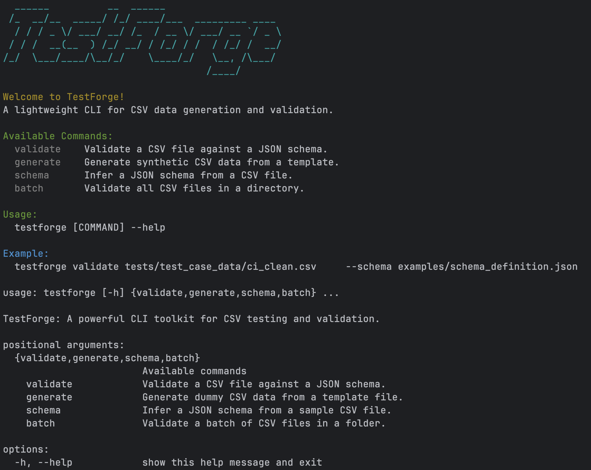
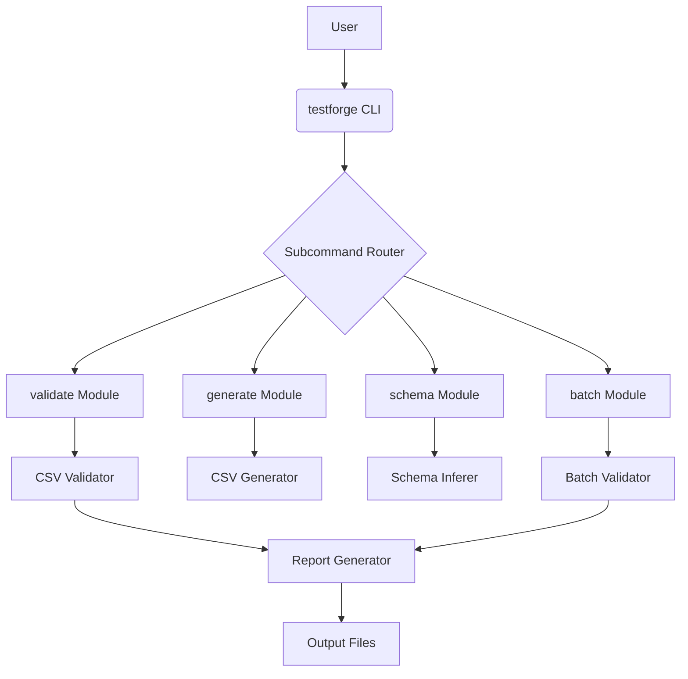

# TestForge

[](https://github.com/romanvlad95/testforge/actions) [](https://pypi.org/project/testforge/) [](https://opensource.org/licenses/MIT) [](https://www.python.org/) [](https://github.com/psf/black)

## Demo starting screen



## Overview

TestForge is a powerful and lightweight Python CLI toolkit for generating, validating, and managing synthetic CSV datasets. It is designed for developers and QA engineers who need to create and maintain high-quality test data for their applications. With TestForge, you can easily define a schema, generate data that conforms to it, and validate existing data against it.

## Table of Contents

- [Overview](#overview)
- [Features](#features)
- [Installation](#installation)
- [Quick Start](#quick-start)
- [Commands](#commands)
- [Contributing](#contributing)
- [License](#license)
- [Changelog](#changelog)

## Architecture



## Features

-   **Validate CSV files**: Ensure data integrity by validating CSV files against a flexible JSON schema.
-   **Generate synthetic data**: Create realistic test CSVs from templates, with control over the number of rows.
-   **Infer schemas**: Automatically generate a JSON schema from an existing CSV file.
-   **Enforce constraints**: Define and enforce a variety of constraints, including `min`/`max`, `regex`, and `enum`.
-   **Generate reports**: Create detailed validation reports in plaintext, Markdown, and HTML formats.
-   **Batch validation**: Validate an entire directory of CSV files at once.
-   **CLI-driven**: A command-line interface that is perfect for CI/CD, scripting, and automation pipelines.
-   **Logging**: All validation logs are saved in the `/reports/validation_logs/` directory for easy debugging.

## Installation

### Prerequisites

-   Python 3.8+

### Setup and Configuration

1.  **Clone the Repository**

    ```bash
    git clone https://github.com/romanvlad95/testforge.git
    cd testforge
    ```

2.  **Create and Activate a Virtual Environment**

    <details>
    <summary>Bash / Zsh (macOS & Linux)</summary>

    ```bash
    python3 -m venv .venv
    source .venv/bin/activate
    ```

    </details>

    <details>
    <summary>PowerShell (Windows)</summary>

    ```powershell
    python -m venv .venv
    .venv\Scripts\Activate.ps1
    ```

    </details>

    <details>
    <summary>CMD (Windows)</summary>

    ```cmd
    python -m venv .venv
    .venv\Scripts\activate.bat
    ```

    </details>

3.  **Install Dependencies**

    Install the project in **editable mode** (`-e`) with development dependencies. This allows you to modify the source code and have the changes immediately reflected in the installed package.

    ```bash
    pip install -e .[dev]
    ```

4.  **Set Up Pre-commit Hooks**

    This project uses `pre-commit` to enforce code quality standards automatically before each commit.

    ```bash
    pre-commit install
    ```

## Quick Start

TestForge is designed for simplicity. Here are a few common use cases to get you started.

-   **Validate a CSV file** against a JSON schema and generate detailed reports.

    ```bash
    testforge validate "tests/test_case_data/ci_clean.csv" --schema "examples/schema_definition.json" --markdown --html
    ```

-   **Generate synthetic CSV data** based on a template file.

    ```bash
    testforge generate "tests/test_case_data/test_case_01.csv" "gen_output.csv" --rows 50
    ```

-   **Infer a JSON schema** from an existing CSV file.

    ```bash
    testforge schema "tests/test_case_data/test_case_01.csv" "inferred_schema.json"
    ```

-   **Validate an entire directory** of CSV files in one go.

    ```bash
    testforge batch "tests/test_case_data/batch" --schema "examples/schema_definition.json"
    ```

## Commands

| Command              | Description                                        |
| -------------------- | -------------------------------------------------- |
| `testforge validate` | Validate a single CSV file against a JSON schema.  |
| `testforge generate` | Generate synthetic CSV data from a template.       |
| `testforge schema`   | Infer a JSON schema from a CSV file.               |
| `testforge batch`    | Validate all CSV files in a directory.             |

**Global Flags:**

-   `--version`: Show the installed TestForge version.
-   `--help`: Display help and available subcommands.

### JSON Schema Format

The schema defines the structure and constraints for each column.

```json
{
  "columns": [
    {
      "name": "age",
      "type": "int",
      "constraints": { "min": 18, "max": 99 }
    },
    {
      "name": "email",
      "type": "str",
      "constraints": { "regex": "^[^@]+@[^@]+\\.[^@]+$" }
    },
    {
      "name": "country",
      "type": "str",
      "constraints": { "enum": ["US", "UK", "BG"] }
    }
  ]
}
```

### Output Files

-   **Logs**: Detailed validation logs are stored in `reports/validation_logs/`.
-   **Reports**: Optional Markdown (`.md`) and HTML (`.html`) reports provide readable summaries.

## Contributing

We welcome contributions! Please follow this guide to get started.

1.  **Fork and Clone**: Fork the repository and clone it locally.
2.  **Create a Branch**: Create a new branch for your feature or fix (`git checkout -b feature/my-new-feature`).
3.  **Develop**: Make your changes. Remember to add or update tests as needed.
4.  **Run Quality Checks**: Ensure your code adheres to project standards.

    ```bash
    # Run all tests
    pytest

    # Check for linting issues
    ruff check .

    # Format code
    black .

    # Run static type analysis
    mypy src/
    ```

5.  **Commit and Push**: Commit your changes and push them to your fork.
6.  **Create a Pull Request**: Open a pull request against the `main` branch.

### Release Process

This project uses `bumpversion` to manage releases, which are automated via GitHub Actions.

1.  **Bump Version**: Use `bumpversion [patch|minor|major]` to update the version across the project.
2.  **Push Tag**: Push the commit and new tag (`git push && git push --tags`).

Pushing a new tag triggers the `release.yml` workflow, which builds, tests, and publishes the package to PyPI.

## License

This project is licensed under the MIT License. See the [LICENSE](LICENSE) file for details.

## Changelog

All notable changes to this project will be documented in the [CHANGELOG.md](CHANGELOG.md) file.
